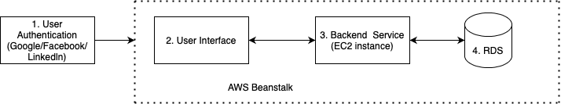

# StudentWorkloadManagement
Student Workload Management
## Flow Diagram:
1. User Authentication using Gmail, Facebook, Linkedin
2. User Interface (React/Nodejs.) including below feature:
    
    a. DashBoard:
    
        a. Tasks (Manage Tasks)
        b. Events
        c. Pinned Events
        d. Options(create new group, filter current tasks)
3. Chat (help)
4. Upload documents related to task for reference

